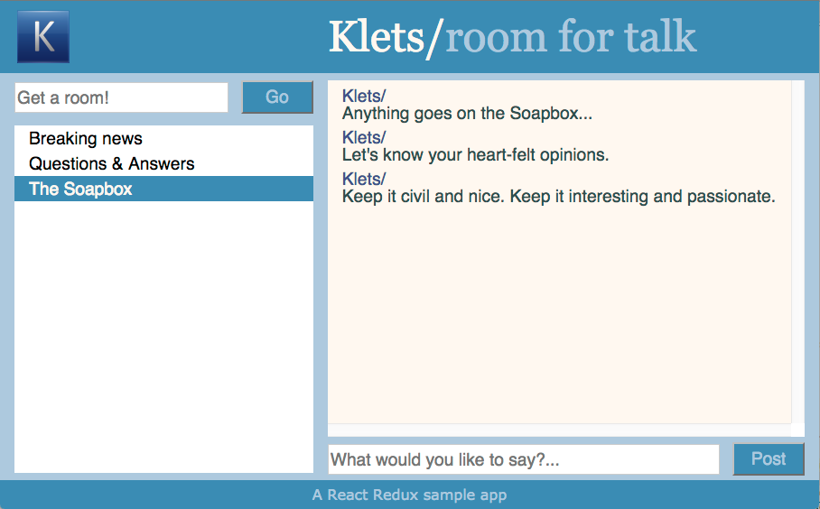

# Klets app
A sample chat app built in Node.js using [React](https://reactjs.net/) and [Redux](http://redux.js.org/).

The app consists of both a client and server component. 

## Running the app
Make sure you have Node.js installed.

Open the console, navigate to sub directory /klets-server and run commands 'npm install' and then 'npm start'. This will start the Klets service running on http://localhost:3030.

Then open another console, navigate to sub directory /klets-client and run commands 'npm install' and then 'npm start'. This will open your browser with http://localhost:3000 with Klets app. 

You can open another tab in your browser to simulate multiple clients.

